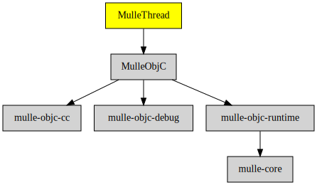

# MulleThread

#### 🍝 MulleThread sleeps until nudged

A MulleInvocationQueue is fed with NSInvocations, which it then executes in
serial in a separate thread.


| Release Version                                       | Release Notes  | AI Documentation
|-------------------------------------------------------|----------------|---------------
|  [](//github.com/MulleFoundation/MulleThread/actions) | [RELEASENOTES](RELEASENOTES.md) | [DeepWiki for MulleThread](https://deepwiki.com/MulleFoundation/MulleThread)


## MulleThread

The MulleThread is the combination of a **NSConditionLock** and **NSThread**.
The thread idles waiting for work. If there is something to do, you `-nudge`
the thread and it runs it's "target" / "selector". Then the thread returns
to idle, waiting for the next `-nudge`.

MulleThread also manages a `NSAutoreleasePool` for your code.


Create a thread and start it:

``` objc
thread = [MulleThread mulleThreadWithTarget:foo
                                   selector:@selector( runServer:)
                                     object:nil];
[thread start];
```

The initial `-start` will not call "target" / "selector" yet. The thread waits
for a `-nudge`. You can `-preempt` the thread at any time. For a more graceful
shutdown use `-cancelWhenIdle`. The thread code can `-cancel` itself at any
time. Use of `+exit` to finish a "MulleThread" is bad style.


``` objc
[thread nudge];
[thread preempt];
[thread cancelWhenIdle];
```

To wait for a thread to complete use `-mulleJoin`. But you need to `-preempt`
or `-cancelWhenIdle` before.


## Requirements

|   Requirement         | Release Version  | Description
|-----------------------|------------------|---------------
| [MulleObjC](https://github.com/mulle-objc/MulleObjC) |  [](https://github.com/mulle-objc/MulleObjC/actions/workflows/mulle-sde-ci.yml) | 💎 A collection of Objective-C root classes for mulle-objc
| [mulle-objc-list](https://github.com/mulle-objc/mulle-objc-list) |  [](https://github.com/mulle-objc/mulle-objc-list/actions/workflows/mulle-sde-ci.yml) | 📒 Lists mulle-objc runtime information contained in executables.

### You are here



## Add

Use [mulle-sde](//github.com/mulle-sde) to add MulleThread to your project:

``` sh
mulle-sde add github:MulleFoundation/MulleThread
```

## Install

Use [mulle-sde](//github.com/mulle-sde) to build and install MulleThread and all dependencies:

``` sh
mulle-sde install --prefix /usr/local \
   https://github.com/MulleFoundation/MulleThread/archive/latest.tar.gz
```

### Legacy Installation

Install the requirements:

| Requirements                                 | Description
|----------------------------------------------|-----------------------
| [MulleObjC](https://github.com/mulle-objc/MulleObjC)             | 💎 A collection of Objective-C root classes for mulle-objc
| [mulle-objc-list](https://github.com/mulle-objc/mulle-objc-list)             | 📒 Lists mulle-objc runtime information contained in executables.

Download the latest [tar](https://github.com/MulleFoundation/MulleThread/archive/refs/tags/latest.tar.gz) or [zip](https://github.com/MulleFoundation/MulleThread/archive/refs/tags/latest.zip) archive and unpack it.

Install **MulleThread** into `/usr/local` with [cmake](https://cmake.org):

``` sh
PREFIX_DIR="/usr/local"
cmake -B build                               \
      -DMULLE_SDK_PATH="${PREFIX_DIR}"       \
      -DCMAKE_INSTALL_PREFIX="${PREFIX_DIR}" \
      -DCMAKE_PREFIX_PATH="${PREFIX_DIR}"    \
      -DCMAKE_BUILD_TYPE=Release &&
cmake --build build --config Release &&
cmake --install build --config Release
```

## Author

[Nat!](https://mulle-kybernetik.com/weblog) for Mulle kybernetiK  


